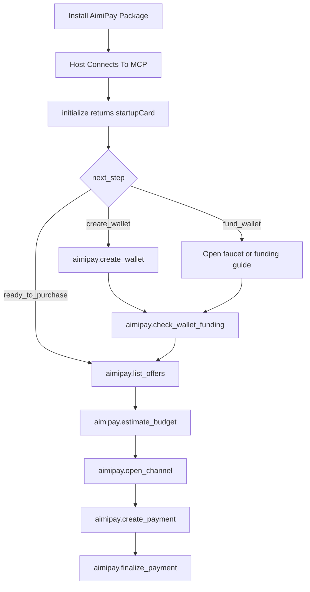

# AimiPay Agent Showcase

Tron-first, agent-native programmable payments packaged for installable skills, plugins, and MCP hosts.

This page is the handoff view for demos, partner reviews, and internal alignment. It collects the key visuals, flows, and entry links in one place.

## What Is Ready

- Installable agent package with skill, plugin, and MCP server wiring
- First-start onboarding that can create a buyer wallet automatically
- Funding guidance that distinguishes `local_smoke` from Nile/live Tron
- Host-facing startup card metadata for Claude, CUA, and Codex-style UIs
- Claude Desktop end-to-end example with a rendered first-screen demo

## Key Demo Links

- Claude first-screen HTML demo:
  [agent-dist/hosts/claude-desktop/demo.startup_card.html](./agent-dist/hosts/claude-desktop/demo.startup_card.html)
- Claude end-to-end walkthrough:
  [agent-dist/hosts/claude-desktop/E2E_WALKTHROUGH.md](./agent-dist/hosts/claude-desktop/E2E_WALKTHROUGH.md)
- Host installation checklist:
  [agent-dist/HOST_INSTALL_CHECKLIST.md](./agent-dist/HOST_INSTALL_CHECKLIST.md)
- MCP integration guide:
  [spec/MCP_INTEGRATION_GUIDE.md](./spec/MCP_INTEGRATION_GUIDE.md)
- Agent integration guide:
  [spec/AGENT_INTEGRATION_GUIDE.md](./spec/AGENT_INTEGRATION_GUIDE.md)

## Key Visuals

Claude-style onboarding demo:
[agent-dist/hosts/claude-desktop/demo.startup_card.html](./agent-dist/hosts/claude-desktop/demo.startup_card.html)

Primary startup card icons:


Visual theme tokens:
[agent-dist/assets/startup-card/theme.tokens.json](./agent-dist/assets/startup-card/theme.tokens.json)

Copy guidelines:
[agent-dist/assets/startup-card/copy-guidelines.md](./agent-dist/assets/startup-card/copy-guidelines.md)

Example startup card payload:
[agent-dist/assets/startup-card/example.startup_card.json](./agent-dist/assets/startup-card/example.startup_card.json)

## Core Flow



## Host Adapters

- Claude Desktop adapter:
  [agent-dist/hosts/claude-desktop/ONBOARDING_ADAPTER.md](./agent-dist/hosts/claude-desktop/ONBOARDING_ADAPTER.md)
- CUA adapter:
  [agent-dist/hosts/cua/ONBOARDING_ADAPTER.md](./agent-dist/hosts/cua/ONBOARDING_ADAPTER.md)
- Codex adapter:
  [agent-dist/hosts/codex/ONBOARDING_ADAPTER.md](./agent-dist/hosts/codex/ONBOARDING_ADAPTER.md)

Host-specific startup card templates:

- Claude:
  [agent-dist/hosts/claude-desktop/startup_card.template.json](./agent-dist/hosts/claude-desktop/startup_card.template.json)
- CUA:
  [agent-dist/hosts/cua/startup_card.template.json](./agent-dist/hosts/cua/startup_card.template.json)
- Codex:
  [agent-dist/hosts/codex/startup_card.template.json](./agent-dist/hosts/codex/startup_card.template.json)

## Installation Entry Points

Windows local install:

```powershell
powershell -ExecutionPolicy Bypass -File python/bootstrap_local.ps1
```

Codex home-local registration:

```powershell
powershell -ExecutionPolicy Bypass -File python/register_codex_home_local.ps1 -RunDoctor
```

Agent package install:

```powershell
powershell -ExecutionPolicy Bypass -File python/install_agent_package.ps1 --target all --mode home-local
```

## Onboarding And Funding Entry Points

- Wallet creation:
  `python -m ops_tools.wallet_setup --force-create`
- Funding guidance:
  `python -m ops_tools.wallet_funding`
- First-start onboarding:
  `python -m ops_tools.agent_onboarding`
- Buyer funding checklist:
  [python/BUYER_FUNDING_CHECKLIST.md](./python/BUYER_FUNDING_CHECKLIST.md)

## Recommended Demo Order

1. Open the Claude HTML demo.
2. Walk through the end-to-end Claude integration doc.
3. Show the startup card schema and host adapters.
4. Show the wallet/funding onboarding tools.
5. End with MCP lifecycle docs and install entry points.

## Fast Hand-Off

If someone only needs three links, send them:

- [SHOWCASE.md](./SHOWCASE.md)
- [agent-dist/hosts/claude-desktop/demo.startup_card.html](./agent-dist/hosts/claude-desktop/demo.startup_card.html)
- [agent-dist/HOST_INSTALL_CHECKLIST.md](./agent-dist/HOST_INSTALL_CHECKLIST.md)
